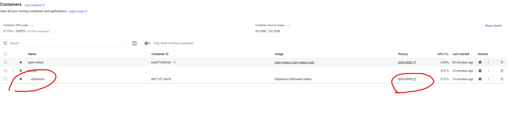

# SillyTavern 酒馆完整部署教程 - 保姆级安装指南 🎮

> 如果你是编程小白，或者只想快速部署酒馆，可以看看我们的[零基础傻瓜版教程](simple_docker.md) - 那边只需要按回车就能装好！
> 
> 这个版本会详细解释每个安装步骤，适合想要了解技术细节或需要更灵活配置的朋友们。来和我一起深入了解如何搭建属于你的虚拟酒馆吧！😊

!!! warning "开始前的必读提示"
    * 本教程为完整版，会包含一些技术概念的解释，便于你日后维护和调试
    * 记得全程开启 VPN（除非你已经在墙外啦），因为我们需要访问 GitHub
    * 每个步骤都有详细说明，建议按顺序完成，这样出问题时也容易定位
    * 目前是 Windows 版本的教程，Mac 和 Linux 的配置会有所不同

## 为什么选择 Docker 部署？🤔

相比直接安装，Docker 部署有这些优势：

* **隔离环境**：不会污染系统环境，想删除时也很干净
* **跨平台兼容**：同样的部署方式适用于各种系统
* **版本管理**：可以轻松切换不同版本，支持多开
* **自动运维**：开机自启动，无需手动管理
* **标准化配置**：避免各种环境问题导致的配置困难

当然，也存在一些需要注意的地方：

* 首次配置需要多装一个 Docker（但后面部署其他应用也能用）
* 更新时需要注意备份（不过我们会提供完整的备份说明）

## 前置环境配置 🛠️

### Docker Desktop 安装

1. 去 [Docker Desktop 官网](https://www.docker.com/get-started/) 逛一下

2. 点击下载按钮（就是那个显眼的蓝色按钮啦）

    [截图位置：Docker 网站主页，红圈标注下载按钮](assets/image8.png)

3. 下载完双击安装就好

4. 一路下一步，不用改任何东西（没错，就是这么简单！）


5. 最后重启一下电脑，让 Docker 安心定居在你的电脑里~

### Git 安装

1. 访问 [Git 官网](https://git-scm.com/downloads/win)

2. 点击下载按钮（Windows 版本）

    

3. 安装的时候也是一路下一步就好啦~


## 检查一下准备工作做得怎么样 ✅

1. 按一下键盘左下角的 Windows 键（找不到的话...那就百度一下吧 😅）

2. 在搜索框输入 "cmd"，打开我们的老朋友命令提示符

    

3. 在黑框框里输入：

    ```bash
    git
    ```

    应该能看到一大堆 Git 相关的说明：

    

4. 再输入：

    ```bash
    docker
    ```

    也会看到一堆 Docker 的介绍：

    

!!! tip "小贴士"
    如果上面哪个命令没反应，可能是安装出了小问题，重新装一下对应的软件就好啦~

## 开始部署我们的小酒馆！🚀

1. 找一个你喜欢的文件夹（用来存放酒馆）

2. 点击上面的地址栏，复制路径

    

3. 在命令提示符里输入这些命令（记得把路径换成你自己的）：

    ```bash
    cd <你的文件路径>
    git clone https://github.com/SillyTavern/SillyTavern.git
    cd SillyTavern\docker
    ```

    !!! note "小提示"
        如果中途关掉了命令窗口，记得重新 cd 到正确的地方哦~
        比如：`cd H:\MyFolder\SillyTavern\docker`
        确保路径末尾是 `SillyTavern\docker`

4. 输入启动命令：

    ```bash
    docker compose up
    ```

    等待进度条走完就好啦~

    现在让我们确认一下酒馆是否部署成功：
    * 打开 Docker Desktop
    * 点击左侧的 Containers 按钮
    * 检查是否有一个名为 "sillytavern" 的容器
    * 如果看到绿色状态标记和 "Running" 状态，就说明部署成功啦！

    

5. 现在需要添加允许访问的IP：
    * 先用浏览器访问 `http://localhost:8000/`
    * 你会看到一个报错页面，里面会显示需要添加的IP地址
      
    * 回到安装文件夹，进入 docker/config 目录
    * 找到 config.yaml 文件并打开
      
    * 在 whitelist 下面添加以下IP：
    ```yaml
    whitelist:
      - ::1
      - 127.0.0.1
      - 172.18.0.1  # Docker内网IP
    ```


    !!! info "这些IP是什么？"
        * 这些是本地访问需要用到的IP地址：
        * `::1` 和 `127.0.0.1` 是本机地址
        * `172.18.0.1` 是Docker内网地址
        * 如果报错页面显示了其他IP，也要一起加进去哦~

6. 大功告成！🎉 现在再次访问 `http://localhost:8000/` 就能看到你的专属酒馆啦！

## 更新小酒馆 🔄

!!! warning "更新前的叮嘱"
    一定要记得备份！虽然一般不会出问题，但是备份一下总是好的~ 📦

更新步骤：

1. 复制一份 `SillyTavern\docker` 文件夹的内容（以防万一）

2. 在命令提示符里输入：

    ```bash
    cd <SillyTavern\docker路径>
    docker stop sillytavern
    docker rm sillytavern
    # 运行更新脚本
    docker compose up
    ```

## 最后的小贴士 💡

1. 如果要用 SD、ComfyUI 或 Ollama 之类的本地服务，记得把地址改一下：
    * 原来的 `http://127.0.0.1:xxxx` 
    * 改成 `http://host.docker.internal:xxxx`
    xxxx 是端口号，
    为啥要改？因为我们的酒馆在 Docker 小房子里，要用特殊的方式才能和外面联系啦~

2. 你的所有重要文件（角色卡、世界书、插件等）都在 `SillyTavern\docker` 文件夹里，更新前记得备份哦！

好啦！现在你已经拥有了自己的小酒馆，开始愉快地玩耍吧！🎊 有问题随时问我哦~ 😊